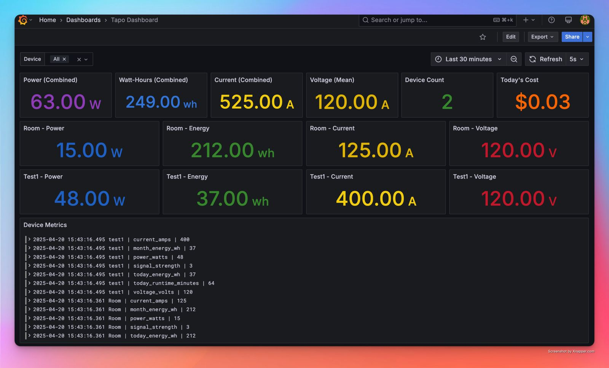

# Tapo Exporter

A Prometheus and InfluxDB exporter for Tapo smart devices, built on top of the [mihai-dinculescu/tapo](https://github.com/mihai-dinculescu/tapo) library.

## Device Support

This exporter has been tested with the following Tapo devices:

- P110 Smart Plug
- P115 Smart Plug

> Note: While the underlying [mihai-dinculescu/tapo](https://github.com/mihai-dinculescu/tapo) library supports many more devices (L510, L520, L530, L535, L610, L630, L900, L920, L930, P100, P105, P300, P304, H100, S200B, KE100, T100, T110, T300, T310, T315), this exporter has only been tested with P110/P115 plugs. Support for other devices may be added in future versions.

## Credits

This project is built on top of the excellent [mihai-dinculescu/tapo](https://github.com/mihai-dinculescu/tapo) library, which provides the core functionality for interacting with Tapo devices. Special thanks to Mihai Dinculescu and all contributors for their work on the original library.

## Features

- Collects metrics from multiple Tapo P110/P115 smart plugs
- Exposes Prometheus metrics for:
  - Power consumption (watts)
  - Voltage (volts)
  - Current (amps)
  - Energy usage (watt-hours)
  - Runtime statistics
  - Device protection status
  - WiFi signal strength
- Configurable update interval
- Environment-based configuration using .env file
- InfluxDB integration for time-series data storage
- Docker support for easy deployment

## Installation

1. Clone this repository:

   ```bash
   git clone https://github.com/j4v3l/tapo-exporter.git
   cd tapo-exporter
   ```

2. Install the package:

   ```bash
   pip install -e .
   ```

## Configuration

Create a `.env` file in the project root with your device configurations:

```bash
# Number of devices to monitor
TAPO_DEVICE_COUNT=2

# Device 1 configuration (P110)
TAPO_DEVICE_1_NAME="Living Room"
TAPO_DEVICE_1_TYPE="p110"
TAPO_DEVICE_1_IP="192.168.1.100"
TAPO_DEVICE_1_EMAIL="your@email.com"
TAPO_DEVICE_1_PASSWORD="your_password"

# Device 2 configuration (P115)
TAPO_DEVICE_2_NAME="Kitchen"
TAPO_DEVICE_2_TYPE="p115"
TAPO_DEVICE_2_IP="192.168.1.101"
TAPO_DEVICE_2_EMAIL="your@email.com"
TAPO_DEVICE_2_PASSWORD="your_password"

# InfluxDB Configuration
INFLUXDB_URL=http://influxdb:8086
INFLUXDB_TOKEN=your_influxdb_token
INFLUXDB_ORG=tapo
INFLUXDB_BUCKET=tapo

# Logging Configuration
LOG_LEVEL=INFO
LOG_DIR=/var/log/tapo
```

Supported device types:

- `p110`: Tapo P110 Smart Plug
- `p115`: Tapo P115 Smart Plug (uses the same API interface as P110)

Note: Both P110 and P115 devices share the same API interface and capabilities. The device type is only used for identification purposes in the logs.

## Usage

### Running Directly

Run the exporter:

```bash
tapo-exporter
```

The exporter will start collecting metrics from your configured Tapo devices and expose them on port 8000 by default.

### Running with Docker

1. Build and start the services:

```bash
docker-compose up -d
```

This will start:

- The Tapo exporter
- Prometheus
- InfluxDB
- Grafana

2. Access the services:

- Grafana: <http://localhost:3000>
- Prometheus: <http://localhost:9090>
- InfluxDB: <http://localhost:8086>

3. Access Grafana Dashboards:

- Default credentials: admin/admin (change on first login)
- Pre-built dashboards are automatically provisioned and can be found under:
  - Home > Dashboards > Tapo
  - The main dashboard shows metrics for all configured devices
  - Individual device metrics are grouped by device name
  - Time-series graphs show historical data from InfluxDB

## Screenshots

### Grafana Dashboard


*Main dashboard showing power consumption, voltage, and current metrics for all devices*

<!-- ### Device Details


*Detailed view of individual device metrics including energy usage and runtime statistics*

### Prometheus Metrics


*Raw metrics exposed by the exporter in Prometheus format* -->

The pre-built dashboards are located in the `grafana/provisioning/dashboards` directory of this repository. You can customize these dashboards by:

1. Modifying the JSON files in the repository
2. Exporting your changes from Grafana and replacing the files
3. Restarting the Grafana container to apply changes

## Metrics

The following metrics are collected:

### Device Metrics

- `tapo_device_count`: Total number of configured devices
- `tapo_device_status`: Device status (1=normal, 0=abnormal) with status_type labels

### Power Metrics

- `tapo_power_watts`: Current power consumption
- `tapo_voltage_volts`: Current voltage
- `tapo_current_amps`: Current amperage
- `tapo_calculated_current_amps`: Calculated current based on power/voltage

### Energy Metrics

- `tapo_today_energy_wh`: Energy consumed today
- `tapo_month_energy_wh`: Energy consumed this month
- `tapo_power_saved_wh`: Power saved through energy-saving features

### Runtime Metrics

- `tapo_today_runtime_minutes`: Runtime today
- `tapo_month_runtime_minutes`: Runtime this month
- `tapo_runtime_seconds`: Total device runtime

### Protection Status

- `tapo_power_protection_status`: Power protection status
- `tapo_overcurrent_status`: Overcurrent protection status
- `tapo_overheat_status`: Overheat protection status

### Signal Metrics

- `tapo_signal_strength`: WiFi signal strength level
- `tapo_signal_rssi`: WiFi signal RSSI

## Prometheus Configuration

Add the following to your Prometheus configuration:

```yaml
scrape_configs:
  - job_name: 'tapo'
    static_configs:
      - targets: ['localhost:8000']
```

## InfluxDB Configuration

The exporter automatically writes metrics to InfluxDB if configured. The following fields are written:

- `power_watts`: Current power consumption
- `voltage_volts`: Current voltage
- `current_amps`: Current amperage
- `today_energy_wh`: Energy consumed today
- `month_energy_wh`: Energy consumed this month
- `today_runtime_minutes`: Runtime today
- `month_runtime_minutes`: Runtime this month
- `power_saved_wh`: Power saved
- `signal_strength`: WiFi signal strength
- `signal_rssi`: WiFi signal RSSI
- `runtime_seconds`: Total runtime
- Protection status fields:
  - `power_protection_status`
  - `overcurrent_status`
  - `overheat_status`

## License

MIT License

### Building and Publishing to Docker Hub

1. Make the build script executable:

   ```bash
   chmod +x build.sh
   ```

2. The build script is configured with:
   - Multi-architecture support (amd64 and arm64)
   - Docker Hub metadata (description, category, version, etc.)
   - Automated version tagging
   - Security best practices (non-root user, multi-stage builds)

3. Run the build script:

   ```bash
   ./build.sh
   ```

The script will:

- Check for Docker and Docker Buildx installation
- Verify Docker Hub login
- Set up a multi-architecture build environment
- Build the image for both amd64 and arm64 architectures
- Add metadata labels for better discoverability
- Push the image to Docker Hub with version and latest tags
- Display the pull command for the new image

To update the version:

1. Edit the `VERSION` file with the new version number
2. Run `./build.sh` again

The published image will include:

- Description: "Prometheus and InfluxDB exporter for Tapo smart devices"
- Category: "monitoring"
- Source code link
- License information
- Build date and version
- Support for both amd64 and arm64 architectures
